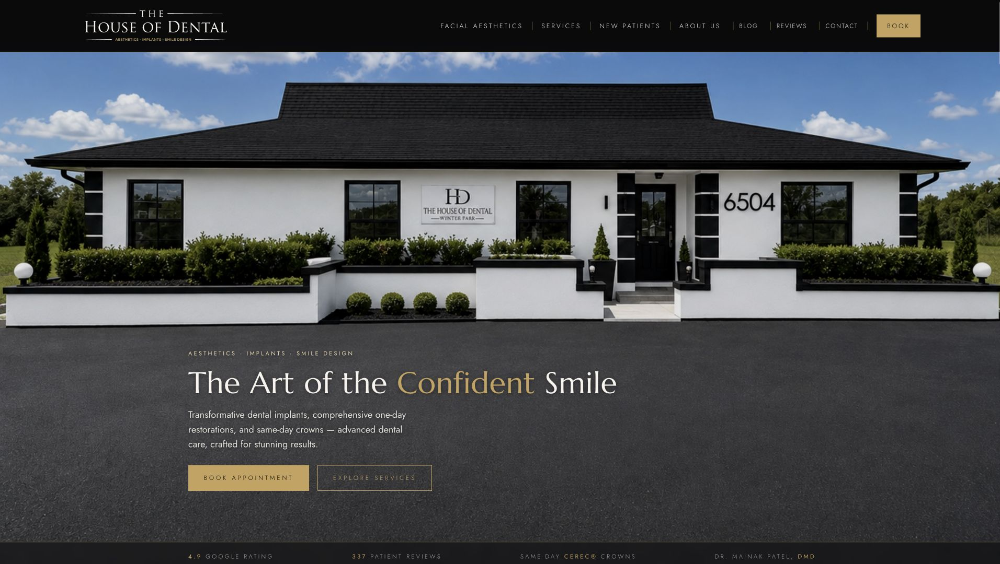
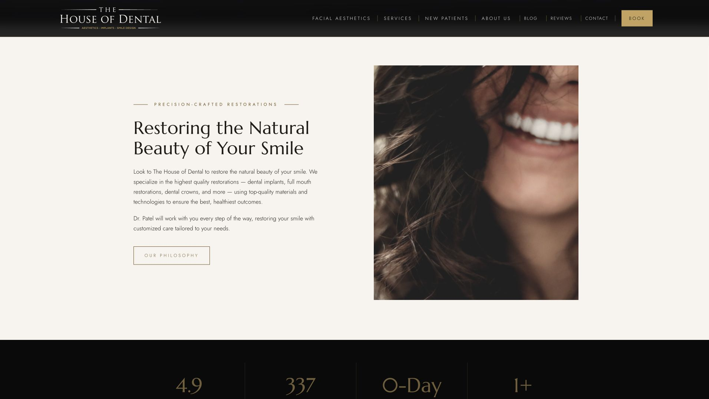
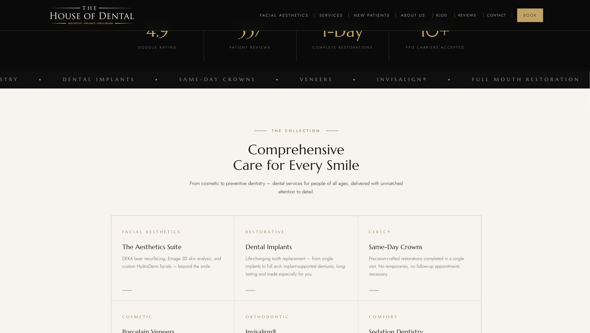
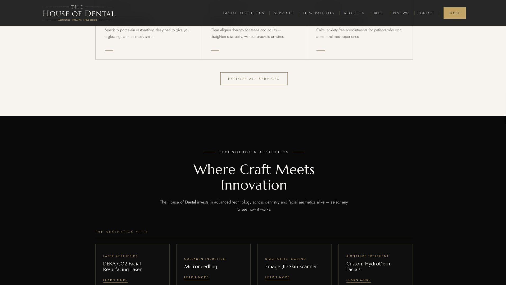
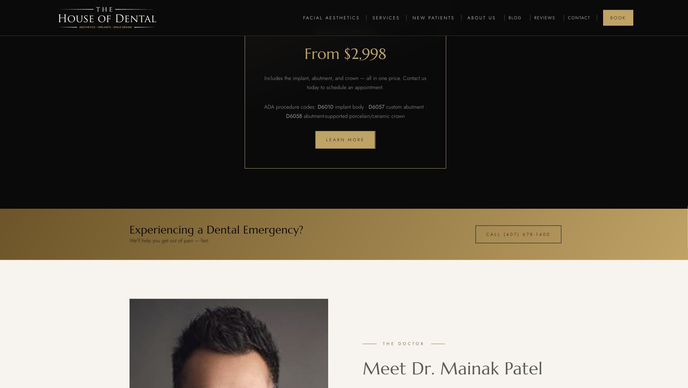
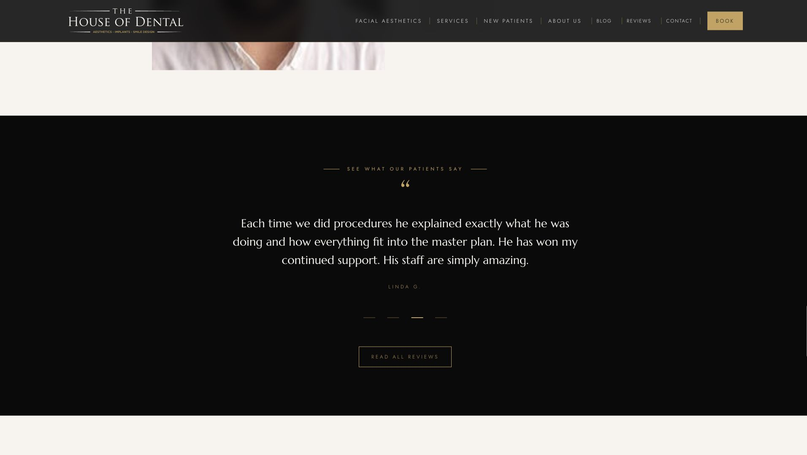
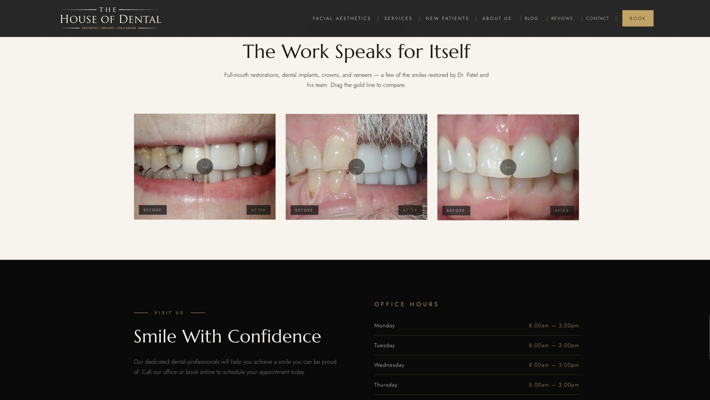
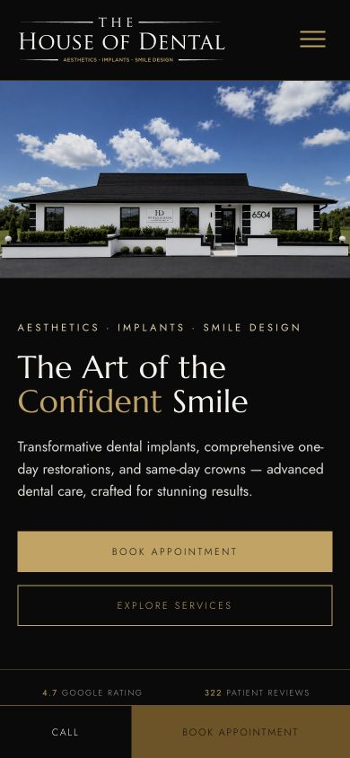
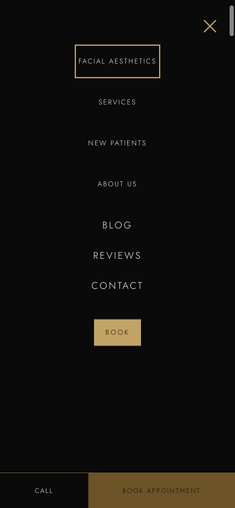

# House of Dental Homepage Optimization Plan

Date: August 30, 2026  
Scope: Homepage information flow, readability, interaction, emotional trust, accessibility, and conversion path  
Status: Planning and audit only. No production source was changed.

## Executive decision

Keep the current black, ivory, and gold visual language, typography, photography style, and premium tone. The redesign should not be a visual reset. It should be a structural edit that makes the same brand easier to understand and more persuasive.

The main problem is sequencing. The homepage asks visitors to read through the philosophy, a repeated proof band, six service cards, eight technology cards, and a large offer before they reach three of the strongest reasons to trust the practice: Dr. Patel, patient reviews, and real treatment results. On the audited 1920×1080 layout, the emergency path begins around 5,431 pixels down the page, the doctor section around 5,574 pixels, the testimonial section around 6,424 pixels, and the before-and-after work around 7,136 pixels. The mobile homepage is approximately 12,893 pixels tall, or more than fifteen 390×844 viewports.

The long-term goal is a page that answers five patient questions in this order:

1. Am I in the right place?
2. Can I trust this practice?
3. Can they help with my problem?
4. What makes this experience better or easier?
5. What should I do next?

## Current evidence

### 1. Entry and hero — healthy design, weak readability

The building image, premium palette, strong headline, and dual call to action establish a clear brand. However, the desktop navigation is only about 12.5 pixels with almost 3 pixels of letter spacing. The hero proof strip is about 11.5 pixels on desktop and 9.3 pixels on mobile. Those sizes are materially too small for an older audience, even though the underlying targets are generally large enough.

The proof strip is also visually passive. Its four items are plain text, so rating, reviews, same-day crowns, and Dr. Patel do not help visitors move deeper into the site.

### 2. Philosophy and proof — attractive, but repetitive

The philosophy split is visually refined, but it includes two paragraphs before a visitor has seen patient outcomes, a recognizable review, or the doctor's qualifications. The image technically includes a smile, but the crop gives substantial visual weight to hair and a partially cut-off face. The photo should be replaced or re-art-directed so the teeth and smile are the unmistakable focal point at every breakpoint.

The dark statistics band repeats the rating and review count that appeared immediately above it. Repetition without added meaning makes the top of the page feel longer rather than more credible.

### 3. Care cards — clear categories, too much reading

The six-card grid is orderly, but each card relies on a category, heading, and paragraph. Current body copy is approximately 14.7 pixels. The only hover behavior is a subtle background change and a longer decorative line. It does not help the visitor understand which service fits their situation.

### 4. Technology — useful content, disproportionate space

The technology section contains useful differentiators, but eight cards create a second service directory inside the homepage. The section is more than a full 1080-pixel viewport tall on large desktop and delays higher-value human proof.

### 5. Offer and emergency — poor contextual placement

The implant offer is isolated in a very large black section and includes procedure-code detail that interrupts the emotional journey. The emergency action is clear once reached, but it appears after roughly five large-screen viewports of content. A visitor in pain should not have to discover it that late.

### 6. Human proof and outcomes — strong, but buried

The testimonial and before-and-after comparisons are the most emotionally persuasive material on the page. They communicate reassurance, quality, and competence more directly than most of the explanatory copy. They should become early proof, not late-page rewards.

### 7. Mobile navigation — usable mechanics, uneven type

The mobile layout has a clear menu control and persistent Call and Book actions. The menu also traps focus and supports Escape in the implementation. However, the first four mobile navigation items render around 11.5 pixels while Blog, Reviews, and Contact render around 16 pixels. That inconsistency is visible and conflicts with the request for even sizing.

## Recommended homepage architecture

| Order | Section | Patient question answered | Primary action |
|---|---|---|---|
| 1 | Header plus urgent-care utility | How do I reach the office? | Call or book |
| 2 | Hero | Am I in the right place? | Book appointment |
| 3 | Linked proof rail | Is this practice credible? | Reviews, crowns, doctor |
| 4 | Results and reassurance | Can I trust the quality and experience? | View results or reviews |
| 5 | Needs-based care chooser | Can they help with my problem? | Select a care need |
| 6 | Technology that changes the visit | What makes treatment easier or better? | Explore relevant technology |
| 7 | Dr. Patel and team reassurance | Who will care for me? | Meet Dr. Patel |
| 8 | Contextual implant offer and payment reassurance | What might this cost and can I pay for it? | View implant details |
| 9 | Final visit block | What should I do next? | Book, call, or get directions |

This reduces the homepage from a directory-like sequence into a narrative: welcome, proof, help, difference, people, action.

## Detailed changes

### A. Navigation and readability

- Increase primary desktop navigation to 16 pixels. Use the same size, weight, line height, and letter spacing for every top-level item.
- Reduce excessive uppercase tracking from roughly 3 pixels to a more readable 1–1.5 pixels. The current wide tracking makes small type harder to scan.
- Keep a minimum 44×44 pixel interactive area for every link and control.
- Make the desktop gaps consistent using one spacing token rather than item-specific margins or separators.
- Use the same 16-pixel size for all mobile menu destinations. Differentiation should come from grouping or a small divider, not inconsistent font sizes.
- Keep Book visually primary. Add a visible phone action in the header or directly beneath it instead of adding another large navigation item.
- Increase general explanatory copy to at least 16 pixels, preferably 17–18 pixels for long-form homepage text aimed at this audience.

Acceptance criteria:

- No primary navigation label is below 16 pixels on desktop or mobile.
- All navigation items use the same typographic rule.
- Navigation remains on one line at supported desktop widths and moves to the existing menu before it becomes crowded.
- Keyboard focus remains visible and the menu still works with Tab, Shift+Tab, and Escape.

### B. Urgent dental care near the top

Add a slim, persistent utility row beneath the main header:

> Dental emergency? Call (407) 678-1400 for help today.

The phone number and the full row should be actionable. On mobile, retain the existing bottom Call action and add the emergency wording near the top without creating a second sticky bar.

This should feel calm, not alarming. Use the existing gold/black treatment with a simple phone icon and no animation.

Acceptance criteria:

- Emergency help is visible without scrolling on desktop and mobile.
- The phone target is at least 44 pixels high.
- The action uses a real `tel:` link and has a clear accessible label.
- The utility row does not compete visually with Book Appointment.

### C. Hero and linked proof rail

Keep the existing hero image and headline unless the client requests a new campaign direction. Tighten the supporting sentence so it presents one promise and one differentiator rather than a list.

Replace the current passive strip and the later repeated statistics band with one larger interactive proof rail:

- Google rating → Reviews page or verified Google review destination
- Patient reviews → Reviews page
- Same-day CEREC crowns → Same-Day Crowns section
- Dr. Mainak Patel, DMD → Doctor section

Each item should be a full linked tile with a short label, visible hover/focus state, and a small directional cue. Use live reputation values from the existing source; do not hardcode a rating or review count into the design.

Recommended sizes:

- Numeric or primary value: 28–36 pixels desktop, 22–28 pixels mobile
- Supporting label: 16–18 pixels desktop, at least 15–16 pixels mobile
- Tile height: at least 72 pixels desktop and 64 pixels mobile

Acceptance criteria:

- All four proof items are links with meaningful destinations.
- Rating and review values appear once in the opening journey, not twice.
- Loading and unavailable states remain honest and do not show fabricated values.
- The entire tile, not only the number, is clickable.

### D. Teeth-focused restoration image

Replace the current lifestyle crop with one of these, in preference order:

1. A consented House of Dental patient smile photographed in the practice's existing visual style.
2. A high-quality close-up smile image where the teeth occupy roughly 35–50% of the frame.
3. A tighter, art-directed crop of an approved source image if it remains sharp at desktop size.

The image should show natural teeth, avoid an overly synthetic stock-photo look, and leave enough negative space to crop reliably at desktop, tablet, and mobile widths. Define explicit `object-position` values for each breakpoint rather than relying on the default center crop.

Acceptance criteria:

- Teeth are the first visual focal point at 1920×1080, 1440×900, 768×1024, and 390×844.
- The mouth is not cut off and hair does not occupy most of the frame.
- Alternative text describes the actual image without implying a treatment result that is not shown.
- Responsive image sizes are used so the replacement does not slow the page.

### E. Move emotional proof into the first two scrolls

Directly after the linked proof rail, create a compact Results and Reassurance block:

- One featured before-and-after comparison
- One short patient quotation focused on explanation, comfort, or quality
- A small Dr. Patel credential line with a link to his full story

This is not a duplicate of the full results or reviews surfaces. It is a preview that answers “Can I trust this place?” before visitors are asked to compare services.

Use only authentic, approved treatment photos and genuine patient quotes already supported by the site. Do not invent outcomes, timelines, or clinical claims.

Acceptance criteria:

- At least one treatment result, one patient voice, and one clinician credential appear by the end of the second large-screen viewport.
- Before-and-after controls work by mouse, touch, and keyboard.
- Any clinical imagery includes appropriate context or a results-vary disclaimer if required by the practice.

### F. Redesign “Comprehensive Care” around patient needs

Rename the section to a question such as “What can we help you with?” and organize the six cards around patient intent:

- Replace missing teeth
- Repair a tooth in one visit
- Improve my smile
- Feel comfortable during treatment
- Keep my teeth healthy
- Explore facial aesthetics

Each card should include:

- A real, consistent image or thumbnail
- A concise outcome-led heading
- One short supporting line, ideally under 18 words
- A visible destination cue such as “See options”

The current hover changes decoration but not understanding. The new interaction should be meaningful:

- At rest: image, need, and one-line benefit are fully understandable.
- On hover or keyboard focus: the image shifts slightly and a short “Best for” or “See options” treatment cue becomes more prominent.
- On touch: the card remains a direct, predictable link. Do not require a first tap to reveal hidden information and a second tap to navigate.

Essential information must never exist only on hover.

Acceptance criteria:

- A visitor can choose a relevant path by reading only the six headings.
- Supporting copy is no smaller than 16 pixels.
- Hover and keyboard focus produce the same information state.
- Motion is subtle, lasts roughly 200–350 milliseconds, and is disabled under reduced-motion preferences.
- Cards remain direct links and do not introduce unnecessary modals.

### G. Compress technology into benefits

Replace eight equal-weight technology cards with a smaller “Technology that changes your visit” section. Lead with three patient benefits:

- One-visit restorations
- More precise implant planning
- Comfortable digital imaging and treatment

If facial aesthetics must remain prominent, use a clear Dental / Facial Aesthetics switch or a secondary row, but do not present all eight technologies at the same visual weight on first view. The existing detailed technology modal can remain available from the smaller set.

Acceptance criteria:

- The section fits within roughly one desktop viewport.
- Each technology is explained in terms of what changes for the patient, not only the equipment name.
- The interaction works with keyboard and touch and communicates modal state to assistive technology.

### H. Reposition the implant offer

Move the offer directly after the implant-related care option or after the compressed technology section. Present it as a contextual card rather than a standalone full-width black chapter:

> Considering dental implants? Complete implant, abutment, and crown package from $2,998.

Keep the price and included items on the homepage. Move ADA procedure codes to the detailed implant page or place them inside an accessible “Pricing details” disclosure. Pair the offer with a concise insurance/financing link so price anxiety has an immediate next step.

Acceptance criteria:

- The offer appears next to relevant implant content.
- The price, scope, and limitations remain factual and client-approved.
- Procedure-code detail is available but does not dominate the homepage.
- The CTA says what happens next, such as “View implant pricing,” rather than a generic “Learn more.”

### I. Create deliberate reasons to keep scrolling

Avoid gimmicks such as a percentage progress meter or constant popups. Use narrative momentum:

- End the hero with a small anchor cue: “See why patients choose us.”
- Let the proof rail visually peek into the next section instead of ending the first screen on a flat boundary.
- Use question-led section headings so each scroll answers the next concern.
- Alternate photography, proof, and concise text rather than stacking several text grids.
- Use a small “Next: see real results” handoff only at major transitions, not between every section.
- Keep the moving treatment marquee only as decoration. Because it moves continuously, add a pause mechanism or replace it with a static, swipeable chip row. Continue respecting reduced-motion settings.

The best scroll hook is unanswered relevance, not motion by itself.

### J. Final conversion block

Retain the final Visit Us section but make it the clearest decision point on the page:

- Book Appointment
- Call the office
- Get directions
- View hours

Include a concise reassurance line such as “New patients welcome” only if approved and accurate. Avoid introducing another generic marketing paragraph at the end.

## Accessibility and older-audience requirements

- Target WCAG 2.2 AA, while recognizing that screenshots alone cannot establish compliance.
- Use at least 16-pixel navigation and supporting text; use 17–18 pixels for longer paragraphs where layout allows.
- Maintain 44×44 pixel minimum controls.
- Avoid low-contrast gray and gold text at small sizes. Test actual color pairs rather than relying on visual judgment.
- Do not use all caps and wide tracking for long phrases.
- Provide visible keyboard focus on every link, card, slider, modal control, and carousel control.
- Ensure every hover state has a focus equivalent and that no essential information is hover-only.
- Preserve `prefers-reduced-motion`; pause or remove nonessential continuous motion.
- Verify the page at 200% browser zoom and at mobile text scaling.
- Keep headings in a logical order and ensure dynamic testimonial or modal changes are understandable to assistive technology.
- Confirm the mobile Call and Book bar does not cover final-page content, dialogs, or focused form controls.

## Measurement plan

Do not evaluate the redesign only by time on page or raw scroll depth. The desired outcome is easier progress toward care.

Track these consent-gated actions with distinct locations:

- Header Book and Call
- Emergency Call
- Hero Book
- Each proof-rail destination
- Each needs-based service selection
- Before-and-after interaction
- Review and doctor links
- Implant offer click
- Final Book, Call, and Directions

Compare a stable pre-change baseline with the post-change period using:

- Appointment-form starts and successful submissions
- Phone clicks
- Click-through from the homepage to high-intent service pages
- Interaction with reviews and results
- Drop-off before the care chooser and before the final visit block

Treat these as directional signals, not proof that the redesign caused every change. Preserve the site's current consent boundary and do not collect form values in analytics.

## Delivery phases

### Phase 1 — Structure and content decisions

- Approve the new section order.
- Decide the primary patient intents used in the care chooser.
- Select the replacement smile image and confirm rights/consent.
- Confirm the exact emergency wording, offer language, review destinations, and clinical disclaimers.

### Phase 2 — High-priority conversion and accessibility work

- Enlarge and normalize navigation.
- Add the urgent-care utility row.
- Build the linked proof rail.
- Remove the repeated rating/review statistics.
- Reposition the results, review, and doctor proof.

### Phase 3 — Service, technology, and offer restructuring

- Build the needs-based care cards.
- Compress the technology section.
- Move and simplify the implant offer.
- Tighten homepage copy and final CTA.

### Phase 4 — Interaction, measurement, and QA

- Add hover/focus/touch states and reduced-motion behavior.
- Add consent-gated event locations.
- Test desktop, tablet, mobile, keyboard, zoom, text scaling, and screen-reader landmarks.
- Inspect rendered screenshots at 1920×1080, 1440×900, 768×1024, and 390×844.
- Run the existing build and validation suite, inspect console errors, and confirm the mobile sticky actions do not obscure content.

## Definition of success

The implementation is ready for client review when:

- Emergency help and the primary appointment action are visible without scrolling.
- Navigation and proof text are comfortably readable for the target audience.
- The opening proof items are all actionable.
- Real results, a patient voice, and clinician credibility appear before the service directory.
- The service chooser is understandable from headings alone.
- The offer feels connected to implant care rather than inserted as a separate campaign.
- No essential information depends on hover.
- The mobile page is materially shorter and does not feel like a sequence of stacked text blocks.
- All claims, reviews, pricing, ratings, and clinical imagery remain genuine and client-approved.

## Evidence limits

This audit reviewed the current local build at desktop, large-display, and mobile widths; inspected the current navigation, proof, service, technology, offer, emergency, testimonial, results, and mobile-menu states; and found no browser console warnings or errors during the captured flow. It did not include live patient usability sessions, a full automated accessibility scan, assistive-technology testing, production analytics, or legal review of medical advertising and before-and-after disclosures.
